# Procast Database Entity Relationship Diagrams

## Overview

This document provides visual entity-relationship diagrams for the Procast database using Mermaid syntax.

---

## Complete High-Level ERD

---

## Domain-Specific ERDs

### 1. User & Authentication Domain

---

### 2. Project Management Domain

---

### 3. Financial & Budget Domain (Core)

```mermaid
erDiagram
    ProjectAccounts {
        uuid Id PK
        uuid ProjectId FK
        uuid LegalEntityAccountId FK
    }
    
    EntryLines {
        uuid Id PK
        varchar Description
        double Quantity
        double Amount
        int Status
        uuid OwnerId FK
        uuid ProjectAccountId FK
        uuid LocalCurrencyId FK
        varchar PurchaseOrderCode
        varchar InvoiceRefCode
        uuid EntryStatusId FK
        uuid ReconciliationId FK
        varchar SupplierName
        uuid SubAccountId FK
        boolean IsComputedInverse
    }
    
    SubAccounts {
        uuid Id PK
        text Name
        double Amount
        uuid AccountId FK
        uuid ProjectId FK
        uuid CurrencyId FK
        uuid ProjectAccountId FK
    }
    
    EntryLine_H {
        uuid Id PK
        text Action
        text TableName
        text OldData
        text NewData
        uuid ProjectAccountId FK
        double LatestViewTotalCurrent
        double LatestViewTotalPrevious
        timestamptz Created
        uuid LastModifiedBy FK
    }
    
    EntryLineSubProject {
        uuid EntryLinesId PK_FK
        uuid SubProjectsId PK_FK
    }
    
    Projects ||--o{ ProjectAccounts : "has"
    ProjectAccounts ||--o{ EntryLines : "contains"
    ProjectAccounts ||--o{ SubAccounts : "has"
    EntryLines }o--o| SubAccounts : "allocated to"
    EntryLines ||--o{ EntryLine_H : "audit trail"
    EntryLines ||--o{ EntryLineSubProject : "tagged"
    SubProjects ||--o{ EntryLineSubProject : "tags"
```

---

### 4. Account Hierarchy Domain

---

### 5. Currency & FX Domain

---

### 6. Actuals & Reconciliation Domain

---

## Data Flow Diagrams

### Budget Entry Flow

### Currency Conversion Flow

### Budget vs Actuals Reconciliation

---

## Key Cardinality Rules

| Relationship | Cardinality | Description |
|-------------|-------------|-------------|
| People → AspNetUsers | 1:1 | Every person has exactly one identity |
| People → ProjectPeople | 1:N | A person can be in many projects |
| Projects → ProjectAccounts | 1:N | A project has many account assignments |
| ProjectAccounts → EntryLines | 1:N | Each account-project pair has many entries |
| AccountCategories → AccountCategories | 1:N | Self-referencing for hierarchy |
| Currencies → CurrencyTuples | 1:N | Each currency can be in many pairs |
| CurrencyTuples → ConstantFxRates | 1:N | Each pair has rates for many months |
| EntryLines → EntryLine_H | 1:N | Each entry has audit history |
| Projects → Projects | 1:N | Scenarios reference original project |

---

## Notes for Implementation

1. **UUID Primary Keys**: All tables use UUID for primary keys, enabling distributed ID generation
2. **Soft Deletes**: `IsDisabled` column is used instead of hard deletes
3. **Audit Trail**: All tables have `Created`, `CreatedBy`, `LastModified`, `LastModifiedBy`
4. **Self-References**: `AccountCategories` and `Projects` have self-referencing FKs
5. **Composite Keys**: Junction tables like `EntryLineSubProject` use composite PKs
